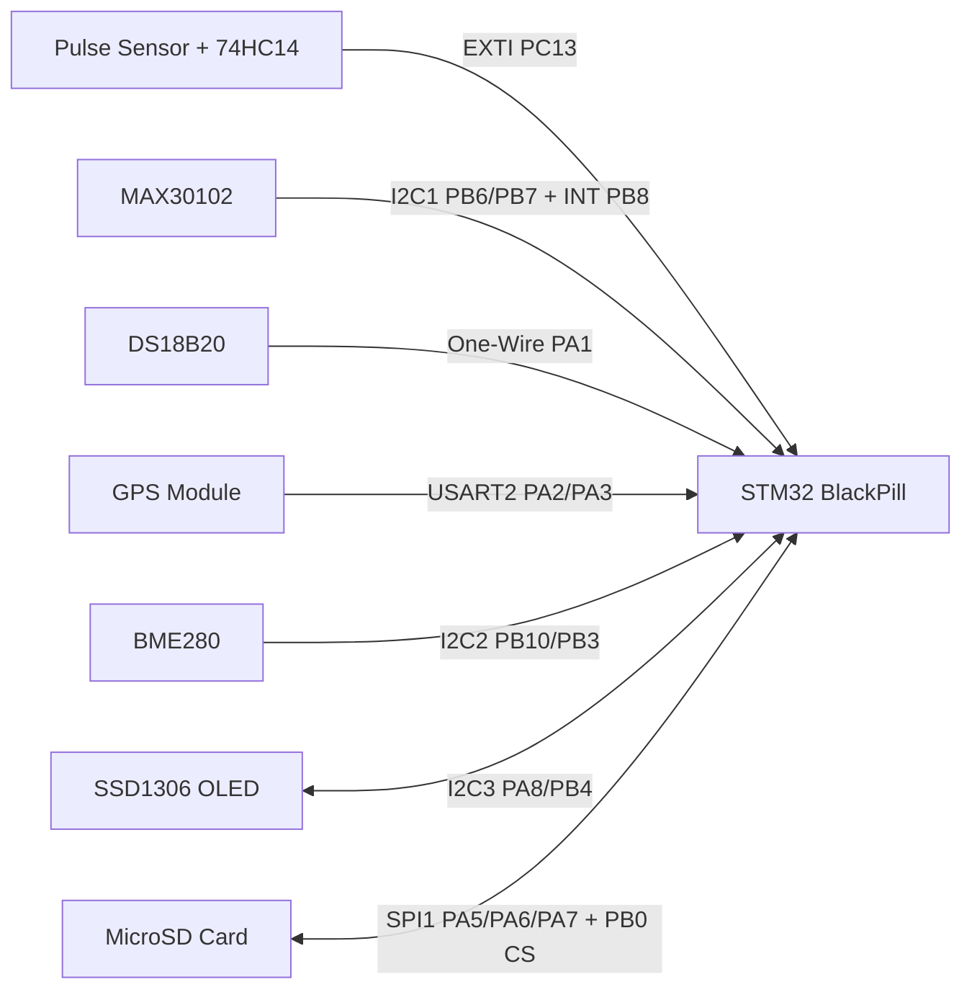

# STM32 BlackPill Runner Data Logger

This graduation project is an embedded data logger designed to monitor short-distance runners in real time. It uses an STM32 BlackPill development board and external sensor modules to collect physiological, environmental, and motion-related data during a run.

The firmware measures blood oxygen saturation, heart rate, body temperature, GPS-based position/speed/acceleration, and starting environmental conditions. Filtered values are written to an SD card in a CSV-compatible text file.

> Note: This project is intended for education and prototyping. It is not a calibrated medical device and should not be used for diagnosis, treatment, or professional medical decision-making.

## Project Summary

| Feature | Description |
| --- | --- |
| Main controller | STM32F411CEUx-based STM32 BlackPill |
| Development environment | STM32CubeIDE |
| Data logging | CSV-compatible `.txt` file on an SD card through FatFs |
| Live display | SSD1306 OLED display |
| Heart-rate sensing | Pulse sensor + 74HC14 Schmitt trigger + EXTI interrupt |
| SpO2 sensing | MAX30102 optical pulse oximeter module |
| Body temperature | DS18B20 one-wire temperature sensor |
| Position and motion calculations | GPS module + `lwgps` parser library |
| Environmental data | BME280 temperature, humidity, and pressure module |
| Filtering | Moving average filter |

## Hardware Used

- STM32 BlackPill development board, STM32F411CEUx
- MAX30102 pulse oximeter / SpO2 sensor module
- Pulse sensor
- 74HC14 Schmitt trigger IC
- UART GPS module with NMEA output
- DS18B20 digital temperature sensor
- BME280 environmental temperature, humidity, and pressure sensor
- SSD1306 I2C OLED display
- MicroSD card module
- Start and stop buttons
- 3.3 V-compatible power and required pull-up / pull-down resistors

## Pin Connections

The pin assignments below are taken from `Birlestirme_F4.ioc` and `Core/Inc/main.h`.

| Module / Function | STM32 pin | Peripheral / Mode | Description |
| --- | --- | --- | --- |
| Pulse sensor + 74HC14 output | PC13 | EXTI falling edge | Captures heart-rate pulses by interrupt. |
| DS18B20 data | PA1 | GPIO output/input | The one-wire pin is switched between output and input in software. |
| GPS RX input from STM32 | PA2 | USART2_TX | Connects to the GPS module RX pin. |
| GPS TX output to STM32 | PA3 | USART2_RX | Receives NMEA data from the GPS module TX pin. |
| SD card SCK | PA5 | SPI1_SCK | SPI clock line. |
| SD card MISO | PA6 | SPI1_MISO | Data from SD card to STM32. |
| SD card MOSI | PA7 | SPI1_MOSI | Data from STM32 to SD card. |
| SD card CS | PB0 | GPIO output | SD card chip-select line. |
| BME280 SCL | PB10 | I2C2_SCL | Environmental sensor I2C clock. |
| BME280 SDA | PB3 | I2C2_SDA | Environmental sensor I2C data. |
| Start button | PB12 | EXTI rising edge, pull-down | Requests logging start. |
| Stop button | PB14 | EXTI rising edge, pull-down | Requests logging stop. |
| OLED SCL | PA8 | I2C3_SCL | SSD1306 I2C clock. |
| OLED SDA | PB4 | I2C3_SDA | SSD1306 I2C data. |
| Debug UART TX | PA9 | USART1_TX | Optional serial debug output. |
| Debug UART RX | PA10 | USART1_RX | Optional serial debug input. |
| MAX30102 SCL | PB6 | I2C1_SCL | Pulse oximeter I2C clock. |
| MAX30102 SDA | PB7 | I2C1_SDA | Pulse oximeter I2C data. |
| MAX30102 INT | PB8 | EXTI falling edge, pull-up | MAX30102 FIFO/data-ready interrupt line. |

## Peripheral Configuration

| Peripheral | Configuration | Used for |
| --- | --- | --- |
| I2C1 | Fast mode, 400 kHz | MAX30102 |
| I2C2 | Fast mode, 400 kHz | BME280 |
| I2C3 | Fast mode, 400 kHz | SSD1306 OLED |
| SPI1 | Master, prescaler 32, about 3.125 Mbit/s | SD card |
| USART1 | 9600 baud | Debug port |
| USART2 | 9600 baud | GPS NMEA data |
| TIM2 | Prescaler `100-1`, period `1000-1` | Run timer and sampling counter |
| TIM5 | Prescaler `100-1` | Microsecond delay base for DS18B20 |
| FatFs | Generic FATFS | SD card filesystem |

## System Architecture



## Operating Logic

1. The firmware initializes HAL, the system clock, GPIO, I2C, SPI, UART, timers, and FatFs.
2. The OLED display is initialized and TIM5 is started for DS18B20 microsecond timing.
3. The BME280 is configured in normal mode and environmental values are sampled.
4. The GPS parser is initialized and USART2 interrupt reception is enabled.
5. The MAX30102 is configured in SpO2 mode with FIFO, ADC, sampling-rate, pulse-width, and LED-current settings.
6. When PB12 is pressed, the SD card is mounted and a log file name is generated from GPS time/date values.
7. When the first valid GPS coordinates arrive, they are stored as the run start position.
8. During the run, distance is calculated with the Haversine formula.
9. Speed and acceleration are passed through moving-average filters.
10. The OLED shows heart rate, SpO2, body temperature, distance, speed, acceleration, logger state, and elapsed time.
11. Logging stops when PB14 is pressed, the 100 m target is reached, or the 4-minute safety limit is exceeded.
12. Summary statistics are appended to the end of the log file.

## Software Flow

The main application flow is implemented in `Core/Src/main.c`.

| Function | Responsibility |
| --- | --- |
| `App_Init()` | Initializes sensors, filters, UART reception, and the OLED display. |
| `App_Run()` | Runs sensor updates, logger processing, and display refresh in the main loop. |
| `PulseOximeter_Process()` | Runs the MAX30102 FIFO handler when an interrupt is pending. |
| `DS18B20_UpdateTemperature()` | Performs DS18B20 conversion and scratchpad reads. |
| `Logger_Process()` | Manages the logger state machine. |
| `Logger_Start()` | Opens the SD card log file and writes CSV headers. |
| `Logger_Record()` | Records GPS, distance, speed, acceleration, heart rate, and body temperature samples. |
| `Logger_Stop()` | Writes summary statistics, closes the file, and unmounts the SD card. |
| `Display_Update()` | Refreshes the live OLED values. |

Logger state values:

| State | Value | Meaning |
| --- | --- | --- |
| `LOGGER_STATE_IDLE` | 0 | Waiting for a start command |
| `LOGGER_STATE_START_REQUESTED` | 1 | Start button event received |
| `LOGGER_STATE_RUNNING` | 2 | Active logging |
| `LOGGER_STATE_STOP_REQUESTED` | 3 | Stop button event received |

## Sensor Operation

### MAX30102 SpO2 Sensor

The MAX30102 is controlled through I2C1 and uses PB8 as an interrupt line. When a FIFO/data-ready interrupt is detected, `max30102_interrupt_handler()` reads the sensor samples. The `max30102_plot()` callback calculates a proportional SpO2 estimate from IR and red LED samples.

Main MAX30102 settings in the firmware:

- FIFO sample average: 8
- ADC resolution: 2048
- Sampling rate: 800 Hz
- LED pulse width: 16 bit
- LED current: 6.2 mA
- Mode: SpO2

### Pulse Sensor + 74HC14 Heart-Rate Measurement

The pulse sensor output is shaped into a clean digital pulse by the 74HC14 Schmitt trigger. The resulting signal is connected to PC13 and captured on a falling-edge EXTI interrupt. The interval between consecutive pulses is measured with `HAL_GetTick()`.

```text
BPM = 60000 / pulse_interval_ms
```

Intervals shorter than 333 ms are ignored to reject false pulses above roughly 180 BPM. The heart-rate value is passed through three moving-average stages.

### GPS and Motion Calculations

The GPS module sends NMEA data over USART2 at 9600 baud. Incoming bytes are collected by interrupt and complete lines are passed to `lwgps_process()`.

After logging starts, the first valid latitude/longitude pair is stored as the start position. Distance between the current position and the start position is calculated with the Haversine formula.

Recorded motion values:

- Latitude
- Longitude
- Distance
- Filtered speed
- Acceleration
- Sea-level-adjusted time

### DS18B20 Body Temperature

The DS18B20 is connected to PA1. The one-wire protocol is implemented by switching the GPIO pin between output and input mode. TIM5 provides the microsecond timing needed by the sensor.

Read sequence:

1. Reset / presence detect
2. `0xCC` Skip ROM
3. `0x44` Convert T
4. Reset
5. `0xCC` Skip ROM
6. `0xBE` Read Scratchpad
7. Read temperature LSB/MSB and convert to Celsius with `raw_temperature / 16.0`

### BME280 Environmental Sensor

The BME280 is read over I2C2. At the beginning of each run, ambient temperature, humidity, and atmospheric pressure are written to the log header to document the session conditions.

BME280 settings in the firmware:

- Temperature oversampling: `OSRS_2`
- Pressure oversampling: `OSRS_16`
- Humidity oversampling: `OSRS_1`
- Mode: `MODE_NORMAL`
- Standby time: `T_SB_0p5`
- IIR filter: `IIR_16`

## SD Card Log Format

The log file is named from GPS time and date values:

```text
hour-minute-second--day-month-year.txt
```

Example:

```text
14-35-8--17-5-2026.txt
```

The file extension is `.txt`, but the content is comma-separated and can be opened as CSV in Excel, LibreOffice Calc, Google Sheets, or pandas.

### CSV Output Preview

```csv
Ambient_Temp(C),Humidity(RH),Atmospheric_Pressure(kPa),Weight,Age
24,47,101.3,90,24

Sample,Time(ms),Latitude,Longitude,Distance(m),Velocity(m/s),Acceleration(m/s^2),Body_Temp(C),Heart_Rate(bpm)
1,0,41.015137,28.979530,0.000,0.000,0.000,36.50,78
2,420,41.015145,28.979548,1.720,0.455,0.112,36.56,82
3,840,41.015158,28.979571,3.914,0.982,0.264,36.62,91
4,1240,41.015180,28.979604,7.350,1.746,0.451,36.70,104
5,1640,41.015211,28.979649,12.260,2.418,0.618,36.78,118
...

Average Heart Rate Normal: 142 

Total_Time(ms),Sea_Level_Time(ms),Total_Distance(m),Average_Speed(m/s),Max_Speed(m/s),Max_Speed_Time(ms),Max_Speed_HR,Max_Speed_Body_Temp,SpO2
24800,25510,100.482,4.052,7.381,9600,168,37.12,97
```

### CSV Fields

| Field | Unit | Description |
| --- | --- | --- |
| `Ambient_Temp(C)` | C | BME280 ambient temperature |
| `Humidity(RH)` | %RH | BME280 relative humidity |
| `Atmospheric_Pressure(kPa)` | kPa | BME280 atmospheric pressure |
| `Weight` | kg | Runner weight |
| `Age` | years | Runner age |
| `Sample` | - | Log sample index |
| `Time(ms)` | ms | Elapsed time from logging start |
| `Latitude` | degrees | GPS latitude |
| `Longitude` | degrees | GPS longitude |
| `Distance(m)` | m | Distance from the start point |
| `Velocity(m/s)` | m/s | Filtered speed |
| `Acceleration(m/s^2)` | m/s^2 | Acceleration calculated from speed change |
| `Body_Temp(C)` | C | DS18B20 body temperature |
| `Heart_Rate(bpm)` | bpm | Filtered heart rate |
| `Total_Time(ms)` | ms | Total run duration |
| `Sea_Level_Time(ms)` | ms | Altitude-adjusted run duration |
| `Total_Distance(m)` | m | Final logged distance |
| `Average_Speed(m/s)` | m/s | Average speed |
| `Max_Speed(m/s)` | m/s | Maximum speed |
| `Max_Speed_Time(ms)` | ms | Time when maximum speed was reached |
| `Max_Speed_HR` | bpm | Heart rate at maximum speed |
| `Max_Speed_Body_Temp` | C | Body temperature at maximum speed |
| `SpO2` | % | MAX30102-based oxygen saturation estimate |

## Filtering and Calculations

The project uses the `moving_average` library with a window length of 9. Heart-rate and speed values are filtered in multiple stages to reduce sensor noise before logging.

Speed calculation:

```text
speed = 1000 * (current_distance - previous_distance) / sample_period_ms
```

Acceleration calculation:

```text
acceleration = 1000 * (new_filtered_speed - previous_filtered_speed) / sample_period_ms
```

Heart-rate evaluation threshold:

```text
high_heart_rate_threshold = (220 - age_years) * 0.8
```

If the average heart rate is above this threshold, `Average Heart Rate High` is written to the log. Otherwise, `Average Heart Rate Normal` is written.

## OLED Display Output

The OLED shows compact live values:

```text
HR:<heart_rate>|O2:<SpO2>|BT:<body_temperature>
Dist,Speed,Accel
<distance>,<speed>,<acceleration>
State:<logger_state>;Time:<elapsed_ms>
```

## Folder Structure

```text
Core/
  Inc/                         Header files and pin definitions
  Src/                         Main application, sensor drivers, and helper code
FATFS/
  App/                         FatFs application layer
  Target/                      SD card disk I/O bridge
Drivers/                       STM32 HAL and CMSIS drivers
Middlewares/Third_Party/       FatFs and FreeRTOS sources
Birlestirme_F4.ioc             STM32CubeMX project and pin configuration
STM32F411CEUX_FLASH.ld         Flash linker script
README.md                      Project documentation
```

## Build and Flash

1. Open the project with STM32CubeIDE.
2. Inspect `Birlestirme_F4.ioc` if pin or peripheral changes are needed.
3. Build with `Project > Build Project`.
4. Connect the STM32 BlackPill through ST-Link.
5. Flash the firmware with `Run` or `Debug`.
6. Format the SD card as FAT/FAT32 and insert it into the SD card module.
7. Power the system, wait for GPS fix, then press PB12 to start logging.
8. Press PB14 to stop logging, or let the firmware stop automatically after 100 m / 4 minutes.

## Usage Notes

- GPS fix is required before a valid start coordinate can be captured.
- The SD card should be formatted as FAT/FAT32.
- The DS18B20 data line requires a proper pull-up resistor.
- I2C modules must be connected with 3.3 V-compatible logic levels.
- The 74HC14 helps clean the pulse-sensor output before EXTI capture.
- Log rows are written when distance increases and the sampling counter exceeds 400 ms.

## Future Improvements

- Add an OLED menu to enter runner weight and age with the buttons
- Display SD card errors on the OLED
- Show GPS fix status on the OLED
- Improve the SpO2 calculation with a more robust pulse-oximetry algorithm
- Write log files directly with a `.csv` extension
- Add Bluetooth or Wi-Fi live telemetry

## License and Third-Party Code

This project includes STM32 HAL, FatFs, `lwgps`, SSD1306, BME280, and MAX30102 driver/library code. Keep the license terms from each third-party source when modifying or redistributing the project.